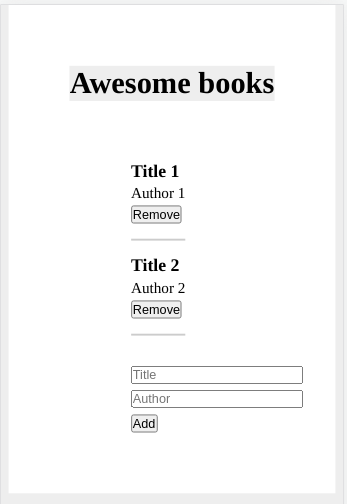
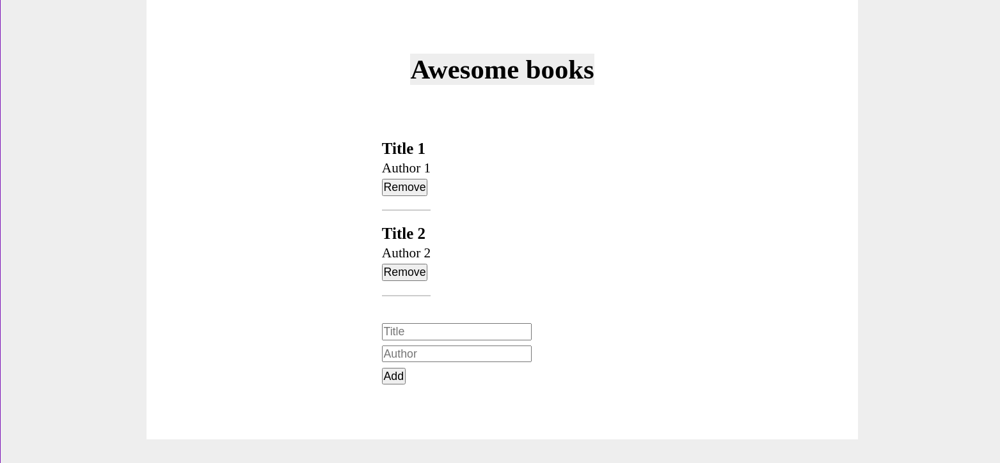

# Awesome books

>	This is an awesome book list app.

>	## Screenshots:

- Mobile version:

- Desktop version:

## Built With

- HTML, CSS and JavaScript.

## Live Demo

[Live Demo Link](https://andres-condezo.github.io/Awesome-books/)

## Learning objectives

- Understand different ways to create objects in JavaScript.
- Create and access properties and methods of JavaScript objects.

## Getting Started

- In order to see the web pagein your browser you must click on the "Live Demo" link.
- To get a local copy up and running follow these simple example steps:

### Prerequisites

No prerequisites are necessary for this project

### Setup

- Clone the repository with the command:

<code>
$ git clone https://github.com/andres-condezo/Awesome-books.git
</code>

### Usage
- Open the file named 'index.html' in your browser.

## Authors

👤 **Andrés Condezo Monge**

- GitHub: [@andres-condezo](https://github.com/andres-condezo)
- Twitter: [@andres_condezo](https://twitter.com/andres_condezo)
- LinkedIn: [andres-condezo](https://linkedin.com/in/andres-condezo)

👤 **José Herrera**

- GitHub: [@Joseheco](https://github.com/joseheco)
- LinkedIn: [joseherreraco](https://linkedin.com/in/joseherreraco)

## Show your support

Give a ⭐️ if you like this project!

## 📝 License

This project is [MIT](./MIT.md) licensed.
